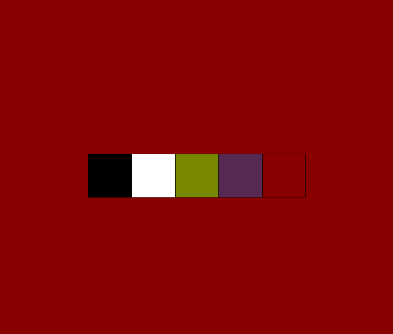
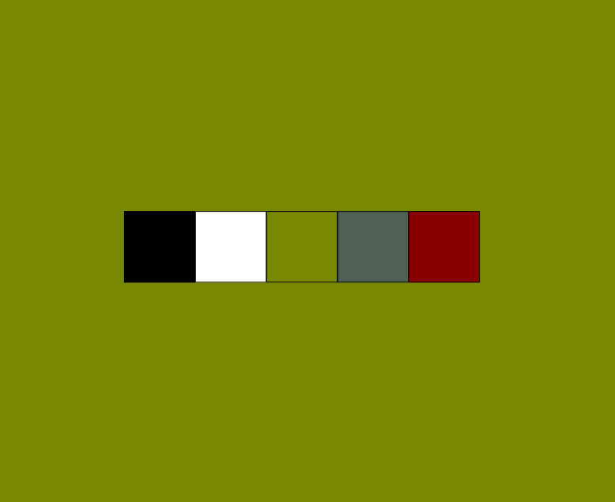

# React coding challenge: Build a colorPicker component

Create a React component called ColorPicker that displays a set of color options as buttons. When a color button is clicked, it should change the background color of the component to the selected color.

## Solution Bootstrapped using Typescript, React and Vite

### Required Skills :

1. Creative thinking
2. Component creation and props
3. State management
4. List rendering

## Challenge level: beginner
